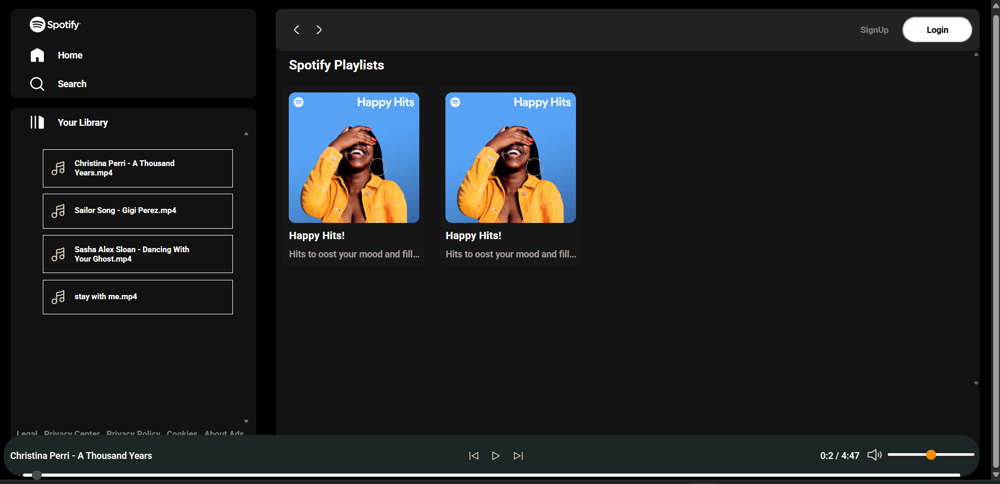

# 🎵 Spotify Clone

A responsive Spotify Clone built using **HTML, CSS, and JavaScript**. The project features a dynamic music player where users can select an album to display its songs and play them.

## 🚀 Features

* 🎵 Dynamic album display
* 📀 Songs are displayed when the user clicks on an album
* ▶️ Play and pause songs
* ⏭️ Next and previous song controls
* 📊 Interactive song progress bar
* 🔊 Volume control
* 🔇 Mute and unmute functionality
* 🎧 Dynamic song information display
* 📱 Responsive design
* 🎨 Modern Spotify-inspired user interface

## 🎯 How It Works

1. The application displays available music albums.
2. The user clicks on an album.
3. The songs belonging to that album are dynamically loaded and displayed in the library.
4. The user can click on a song to start playing it.
5. The music player provides controls for play, pause, next, previous, seeking, volume, and mute.

## 🛠️ Technologies Used

* HTML5
* CSS3
* JavaScript
* Browser Audio API

## 📂 Project Structure

```text
Spotify-Clone/
│
├── index.html
├── style.css
├── utility.css
├── script.js
│
├── svg/
│   ├── play.svg
│   ├── pause.svg
│   ├── nextsong.svg
│   ├── prevsong.svg
│   ├── volume.svg
│   ├── mute.svg
│   └── ...
│
└── songs/
    ├── songs2/
    │   ├── song1.mp3
    │   ├── song2.mp3
    │   ├── cover.jpg
    │   └── info.json
    │
    └── ncs/
        ├── song1.mp3
        ├── song2.mp3
        ├── cover.jpg
        └── info.json
```

## ▶️ How to Run the Project

1. Clone the repository:

```bash
git clone https://github.com/YOUR-USERNAME/YOUR-REPOSITORY-NAME.git
```

2. Navigate to the project folder:

```bash
cd YOUR-REPOSITORY-NAME
```

3. Open the project using a local development server such as **Live Server**.

4. Open `index.html` in your browser.

> ⚠️ This project should be run in a browser using a local server. Do not run `script.js` directly using Node.js because the project uses browser APIs such as the Audio API and DOM.

## 📸 Screenshots


```markdown

```

## 🎓 Learning Outcomes

This project helped me practice:

* DOM manipulation
* JavaScript event listeners
* Asynchronous JavaScript
* Fetch API
* Dynamic content rendering
* Browser Audio API
* Responsive web design
* Dynamic album and song loading

## 📄 Disclaimer

This project was created for educational purposes and is not affiliated with or endorsed by Spotify.

---

⭐ If you like this project, consider giving it a star!
